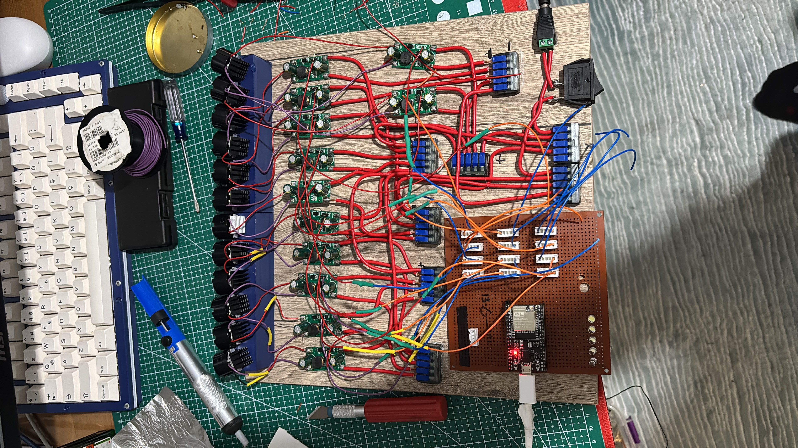
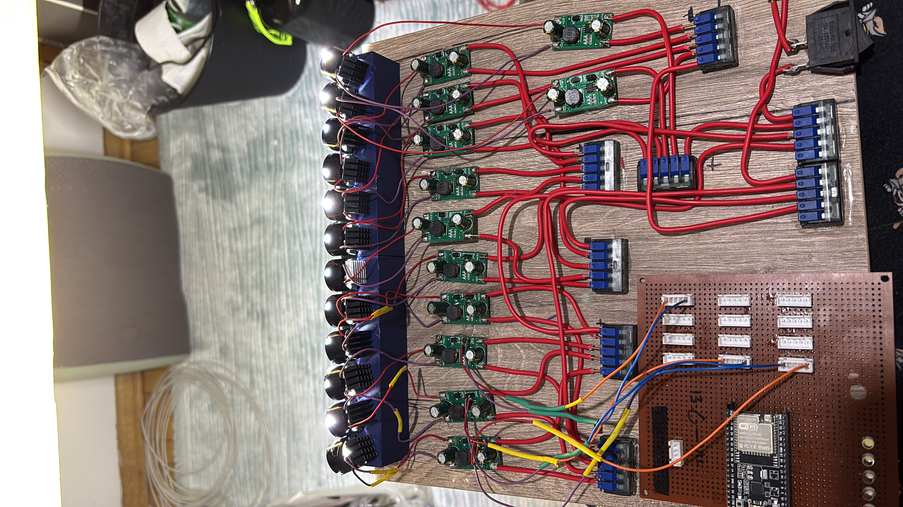
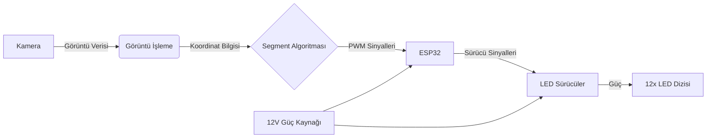
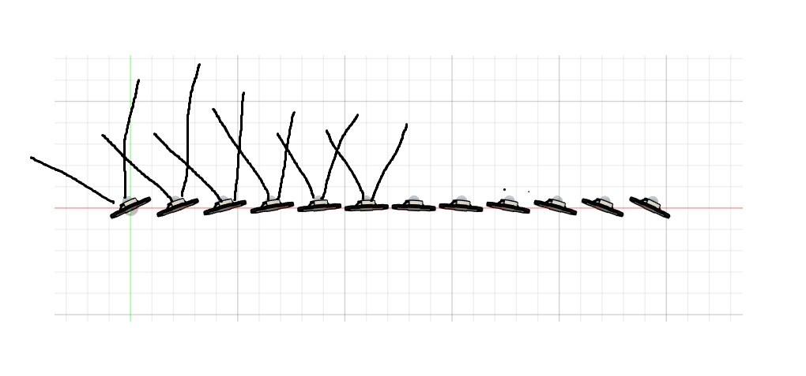
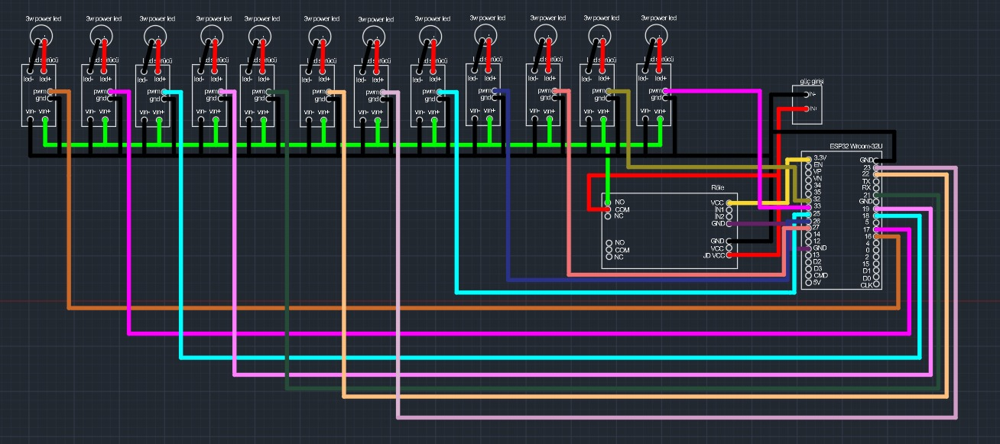
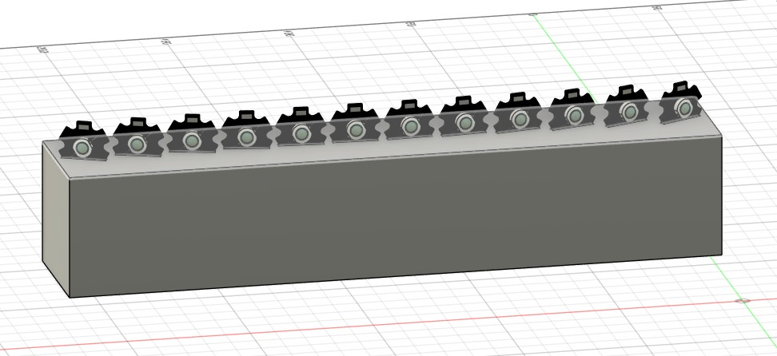

# Matrix Headlight Sistemi (ESP32 + Kamera + 12×3W LED)

> Language: **Türkçe** | [English](README_EN.md)

  
  

Bu proje, Audi’nin Matrix Headlight teknolojisinden ilham alınarak geliştirilmiş, karşı şeritten gelen araçları algılayıp ilgili ışık huzmesini otomatik olarak kapatan **akıllı ve adaptif bir far sistemidir**.

---

## İçindekiler
- [Proje Özeti](#proje-özeti)
- [Çalışma Prensibi](#çalışma-prensibi)
- [Sistem Mimarisi](#sistem-mimarisi)
- [Donanım Tasarımı](#donanım-tasarımı)
- [Gelecek Planları & Geliştirmeler](#gelecek-planları--geliştirmeler)
- [Donanım Listesi](#donanım-listesi)

---

## Proje Özeti
Sistem, karşıdan gelen ışık kaynağını (araç farı vb.) kamera ile tespit eder ve görüntü işleme algoritmalarıyla konumunu belirler. Bu konuma karşılık gelen LED bloğu söndürülerek karşı sürücünün gözünün kamaşması engellenir, ancak yolun geri kalanı aydınlatılmaya devam eder.

**Temel Özellikler:**
- **Adaptif Aydınlatma:** Sadece gereken yeri karartır.
- **Güçlü Işık Çıkışı:** 12 adet 3W Power LED.
- **Hassas Kontrol:** Her LED için bağımsız PWM kontrolü.
- **Görüntü İşleme:** Kamera tabanlı araç algılama.
- **Optik Tasarım:** 5° lensler ile keskin ışık hüzmeleri.

---

## Çalışma Prensibi

1. **Algılama:** Microsoft LifeCam HD kamera, sürekli olarak yolu tarar.
2. **İşleme:** Görüntü işleme algoritması, parlak ışık kaynaklarını (karşıdan gelen araç) tespit eder ve x-koordinatını belirler.
3. **Eşleme:** Tespit edilen koordinat, 12 LED'lik dizideki ilgili segmente (veya segmentlere) haritalanır.
4. **Kontrol:** ESP32, ilgili LED sürücüsüne giden PWM sinyalini keser (veya kısar), diğer LED'leri tam parlaklıkta sürmeye devam eder.

---

## Sistem Mimarisi

---

## Donanım Tasarımı

### Optik Yerleşim
Her LED üzerinde **5 derece lens** bulunmaktadır. Bu dar açılı lensler sayesinde, her bir LED yolun sadece belirli bir dilimini aydınlatır. Böylece bir LED kapatıldığında sadece o şerit kararır.

### Mekanik & Elektronik Yapı
LED'ler lineer bir dizilimle, yatay eksende yolu tarayacak şekilde konumlandırılmıştır.
- **Soğutma:** Yüksek güçlü LED'lerin ömrünü uzatmak için alüminyum soğutucu blok kullanılmıştır.
- **Sürücü Devresi:** Her LED için ayrı bir sabit akım sürücüsü (Constant Current Driver) tasarlanmıştır.

| Elektronik Şema | Mekanik Tasarım |
|----------------|-----------------|
|  |  |

---

## Gelecek Planları & Geliştirmeler
Sistemi daha profesyonel ve ticari standartlara yaklaştırmak için aşağıdaki geliştirmeler planlanmaktadır:

- [ ] **Yüksek Çözünürlüklü Matrix:** 12 LED yerine 32 veya 64 LED kullanılarak daha "pürüzsüz" ve yüksek çözünürlüklü maskeleme yapılması.
- [ ] **Mobil Uygulama Kontrolü:** Bluetooth üzerinden sistem hassasiyet ayarları ve test modlarının kontrol edilmesi.

---

## Donanım Listesi

| Bileşen | Detay | Adet |
|:---|:---|:---:|
| **Mikrodenetleyici** | ESP32 DevKit V1 | 1 |
| **Kamera** | Microsoft LifeCam HD-3000 | 1 |
| **Işık Kaynağı** | 3W High Power LED (Soğuk Beyaz) | 12 |
| **Sürücü** | PT4115 / XL6009 Tabanlı CC Sürücü | 12 |
| **Optik** | 5° Derece Lens | 12 |
| **Güç Kaynağı** | 12V 5A+ DC Adaptör/Akü | 1 |
