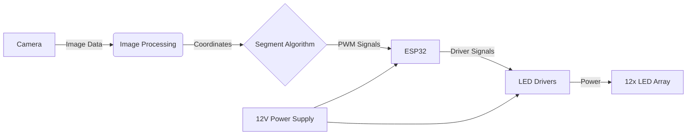

# Matrix Headlight System (ESP32 + Camera + 12×3W LED)

> Language: **English** | [Türkçe](README.md)

  
  

This project is an **intelligent and adaptive matrix headlight system** inspired by Audi’s Matrix LED technology. It detects oncoming vehicles and automatically dims the corresponding light segment to prevent glare while maintaining optimal illumination for the rest of the road.

---

## Table of Contents
- [Project Summary](#project-summary)
- [How It Works](#how-it-works)
- [System Architecture](#system-architecture)
- [Hardware Design](#hardware-design)
- [Future Improvements Roadmap](#future-improvements-roadmap)
- [Hardware List](#hardware-list)

---

## Project Summary
The system uses a camera to detect light sources (e.g., oncoming car headlights) and determines their position using image processing algorithms. The corresponding block in the LED array is then dimmed or turned off to prevent blinding the other driver, while the remaining LEDs continue to illuminate the road.

**Key Features:**
- **Adaptive Lighting:** Dims only where necessary.
- **High Output:** 12x 3W Power LEDs.
- **Precise Control:** Independent PWM control for each LED.
- **Image Processing:** Camera-based vehicle detection.
- **Optical Design:** 5° narrow beam lenses.

---

## How It Works

1. **Detection:** The Microsoft LifeCam HD continuously scans the road ahead.
2. **Processing:** The image processing algorithm identifies bright light sources (oncoming vehicles) and calculates their X-coordinates.
3. **Mapping:** The detected coordinate is mapped to the corresponding segment(s) in the 12-LED array.
4. **Control:** The ESP32 adjusts the PWM signal for the specific LED driver to dim or turn off the segment, keeping others at full brightness.

---

## System Architecture

---

## Hardware Design

### Optical Layout
Each LED is equipped with a **5-degree lens**. These narrow-angle lenses ensure that each LED illuminates only a specific slice of the road. This allows for precise masking—when one LED is turned off, only that specific lane section is darkened.

### Mechanical & Electronic Structure
The LEDs are arranged in a linear array to scan the road horizontally.
- **Cooling:** Aluminum heatsinks are used to manage heat from the high-power LEDs.
- **Driver Circuit:** A dedicated Constant Current Driver is designed for each LED.

| Electronic Schematic | Mechanical Design |
|----------------------|-------------------|
|  |  |

---

## Future Improvements Roadmap
To bring the system closer to professional and commercial standards, the following improvements are planned:

- [ ] **High-Resolution Matrix:** Increasing from 12 LEDs to 32 or 64 LEDs for smoother and higher-resolution masking.
- [ ] **Mobile App Control:** Bluetooth LE interface for adjusting system sensitivity and running calibration tests.

---

## Hardware List

| Component | Detail | Quantity |
|:---|:---|:---:|
| **Microcontroller** | ESP32 DevKit V1 | 1 |
| **Camera** | Microsoft LifeCam HD-3000 | 1 |
| **Light Source** | 3W High Power LED (Cold White) | 12 |
| **Driver** | PT4115 / XL6009 Based CC Driver | 12 |
| **Optics** | 5° Degree Lens | 12 |
| **Power Supply** | 12V 5A+ DC Adapter/Battery | 1 |
